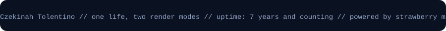

<!-- ============================================================
     Profile README for github.com/czekinah
     Lives in the public repo named exactly: czekinah/czekinah
     Two render modes: this page flips with the viewer's GitHub theme.
     Dark theme  = data engineer mode (navy + cyan)
     Light theme = creative writer mode (cream + pink)
     Every animated panel is a plain SVG in /assets. No JS, no tracking.
     Regenerate them with build_svgs.py if you change the copy.
     ============================================================ -->

<picture>
  <source media="(prefers-color-scheme: dark)" srcset="assets/hero-dark.svg">
  <source media="(prefers-color-scheme: light)" srcset="assets/hero-light.svg">
  
</picture>

<picture>
  <source media="(prefers-color-scheme: dark)" srcset="assets/divider-dark.svg">
  <source media="(prefers-color-scheme: light)" srcset="assets/divider-light.svg">
  
</picture>

```sql
SELECT the_right_words
FROM   the_right_place
WHERE  it_actually_matters;
```

**AI-enabled Copywriter · Content Strategist · Data Engineer in training**

I spent 7+ years writing for a living: taglines, TV and radio scripts, SEO content, and B2B SaaS copy across digital agencies, creative advertising, and an AI verification platform. Along the way I discovered that code and copy both live and die by structure.

So now I'm learning to build the systems behind the words: data pipelines, warehouses, and databases designed to mirror how a living, breathing business actually operates.

> *"I built structures for stories for seven years. Rows and columns are just stricter paragraphs."*

<br>

## `$ git log careers/czekinah`

<picture>
  <source media="(prefers-color-scheme: dark)" srcset="assets/gitlog-dark.svg">
  <source media="(prefers-color-scheme: light)" srcset="assets/gitlog-light.svg">
  
</picture>

**`status --now`**

* Data Engineering Scholar at **FTW Foundation** (Batch 12): SQL, data modeling, and Databricks, one Saturday at a time
* **AWS re/Start** Scholar (Batch 29 · PHMAN29): cloud computing fundamentals with AWS
* Keeping a daily **DataCamp** streak, 45 courses completed and counting
* Writing about the journey on [LinkedIn](https://www.linkedin.com/in/czekinah/), one post per week of the program

<br>

## `$ psql -c "SELECT * FROM writer_era;"`

<picture>
  <source media="(prefers-color-scheme: dark)" srcset="assets/receipts-dark.svg">
  <source media="(prefers-color-scheme: light)" srcset="assets/receipts-light.svg">
  
</picture>

<br>

## `$ ls skills/ --sort=passion`

<picture>
  <source media="(prefers-color-scheme: dark)" srcset="assets/skills-dark.svg">
  <source media="(prefers-color-scheme: light)" srcset="assets/skills-light.svg">
  
</picture>

**Building with (in training):**


**Writing & marketing stack (7+ years):**


<br>

## `$ cat certs/datacamp.log | wc -l` → **45**

**45 DataCamp courses completed**, from *Introduction to Python* (the first) to *Building Scalable Agentic Systems*. Click a folder to open it.

<!-- Update this section as you finish new courses.
     Tip: DataCamp, My Activity, Completed tab is your source of truth. -->

<details>
<summary><strong>📂 sql_and_databases/</strong> &nbsp;<code>3 files</code></summary>
<br>

* Introduction to SQL
* Intermediate SQL
* Joining Data in SQL

</details>

<details>
<summary><strong>📂 python/</strong> &nbsp;<code>3 files</code></summary>
<br>

* Introduction to Python
* Python for Spreadsheet Users
* Data Manipulation with pandas

</details>

<details>
<summary><strong>📂 data_engineering_databricks_cloud/</strong> &nbsp;<code>7 files</code></summary>
<br>

* Understanding Data Engineering
* Introduction to Databricks Lakehouse
* Introduction to Databricks SQL
* Data Management in Databricks
* Data Transformation with Spark SQL in Databricks
* Understanding Cloud Computing
* Digital Transformation with Google Cloud

</details>

<details>
<summary><strong>📂 ai_and_llms/</strong> &nbsp;<code>15 files</code></summary>
<br>

* Working with the OpenAI API
* Working with Hugging Face
* Large Language Models (LLMs) Concepts
* Generative AI Concepts
* Generative AI for Business
* Introduction to AI Agents
* Building Scalable Agentic Systems
* Understanding Prompt Engineering
* Introduction to ChatGPT
* Intermediate ChatGPT
* Understanding ChatGPT
* Understanding Artificial Intelligence
* Understanding Machine Learning
* Introduction to AI for Work
* Implementing AI Solutions in Business

</details>

<details>
<summary><strong>📂 responsible_ai_and_data_governance/</strong> &nbsp;<code>8 files</code></summary>
<br>

* AI Ethics
* Responsible AI Practices
* AI Security and Risk Management
* Introduction to Data Ethics
* Introduction to Data Security
* Introduction to Data Privacy
* Introduction to Data Quality
* Introduction to Data Culture

</details>

<details>
<summary><strong>📂 data_literacy_and_storytelling/</strong> &nbsp;<code>8 files</code></summary>
<br>

* Understanding Data Science
* Introduction to Data
* Introduction to Data Literacy
* Data Literacy Case Study: Remote Working Analysis
* Data Communication Concepts
* Data Storytelling Concepts
* Communicating Data Insights
* Understanding Data Visualization

</details>

<details>
<summary><strong>📂 developer_tools/</strong> &nbsp;<code>1 file</code></summary>
<br>

* Introduction to GitHub Concepts

</details>

<details>
<summary><strong>📂 in_progress/</strong> &nbsp;<code>3 files</code> <code>[BUILDING]</code></summary>
<br>

* Data Manipulation in SQL
* Intermediate SQL (AI native version)
* Data Manipulation with pandas (AI native version)

</details>

<br>

## `$ tail -f cat_metrics.log`

A very serious dashboard of very serious numbers. Feed the cat to see the metrics respond.

<details>
<summary><strong>🐾 ./feed_cat.sh</strong> &nbsp;<em>(click to serve a treat)</em></summary>
<br>

<picture>
  <source media="(prefers-color-scheme: dark)" srcset="assets/catalytics-dark.svg">
  <source media="(prefers-color-scheme: light)" srcset="assets/catalytics-light.svg">
  
</picture>

`// interactive demo: user events update state, state re-renders the bars. that is the whole job, basically.`

</details>

<br>

## `$ ssh recruiter@purrfolio`

A tiny shell for the curious. Type `help` to see what it knows.

<details>
<summary><code>czekinah@purrfolio:~$ help</code></summary>
<br>

```
welcome to purrfolio-sh v1.0 (meow-stable)

  whoami        who is this person
  ls projects/  what she is building
  cat contact   how to reach her
  pet           pet the cat
```

<details>
<summary><code>czekinah@purrfolio:~$ whoami</code></summary>
<br>

```
Czekinah Tolentino
Copywriter for 7+ years (agencies, B2B SaaS, an AI verification platform).
Data engineer in training (FTW Foundation Batch 12, AWS re/Start Batch 29).
Based in the Philippines. Open to freelance and full-time.
```

</details>

<details>
<summary><code>czekinah@purrfolio:~$ ls projects/</code></summary>
<br>

```
herding_the_data/            [BUILDING]   cat shelter ETL: raw CSVs in, warehouse tables out
campaign_metrics_warehouse/  [DESIGNING]  seven years of campaign results as a star schema
sql_scratching_post/         [DAILY]      one query drill a day keeps the rust away
week6-instacart-pipeline/    [IN REVIEW]  bronze → silver → gold → dashboard on Databricks
```

</details>

<details>
<summary><code>czekinah@purrfolio:~$ cat contact</code></summary>
<br>

```
linkedin : https://www.linkedin.com/in/czekinah/
behance  : https://www.behance.net/czekinah
email    : tolentino.czekinah@gmail.com
site     : https://czekinah.github.io/
```

</details>

<details>
<summary><code>czekinah@purrfolio:~$ pet</code></summary>
<br>

```
purr_level: 58% → 100%
the cat approves of you.
```

</details>

</details>

<br>

## `$ git stats`

<!-- These cards fill in as you commit. They will look quiet for the
     first few weeks. That is the point: watch them grow. -->

<picture>
  <source media="(prefers-color-scheme: dark)" srcset="https://github-readme-stats.vercel.app/api?username=czekinah&show_icons=true&hide_rank=true&hide_border=true&bg_color=101B33&title_color=2BE3DF&text_color=E9F1FF&icon_color=5DFF87">
  <source media="(prefers-color-scheme: light)" srcset="https://github-readme-stats.vercel.app/api?username=czekinah&show_icons=true&hide_rank=true&hide_border=true&bg_color=FFFFFF&title_color=D81B7F&text_color=43223B&icon_color=FF69B4">
  
</picture>

<picture>
  <source media="(prefers-color-scheme: dark)" srcset="https://streak-stats.demolab.com?user=czekinah&hide_border=true&background=101B33&ring=2BE3DF&fire=5DFF87&currStreakLabel=2BE3DF&sideLabels=E9F1FF&currStreakNum=E9F1FF&sideNums=E9F1FF&dates=8FA3C7">
  <source media="(prefers-color-scheme: light)" srcset="https://streak-stats.demolab.com?user=czekinah&hide_border=true&background=FFFFFF&ring=FF69B4&fire=D81B7F&currStreakLabel=D81B7F&sideLabels=43223B&currStreakNum=43223B&sideNums=43223B&dates=82627B">
  
</picture>

<!-- Uncomment once you have a few repos with code in them:
<picture>
  <source media="(prefers-color-scheme: dark)" srcset="https://github-readme-stats.vercel.app/api/top-langs/?username=czekinah&layout=compact&hide_border=true&bg_color=101B33&title_color=2BE3DF&text_color=E9F1FF">
  <source media="(prefers-color-scheme: light)" srcset="https://github-readme-stats.vercel.app/api/top-langs/?username=czekinah&layout=compact&hide_border=true&bg_color=FFFFFF&title_color=D81B7F&text_color=43223B">
  
</picture>
-->

<br>

## `$ ./say_hi --channel=any`

For campaigns, content, or a chat about the writer-to-data plot twist.
`// recruiter-friendly. cat-approved. responds faster than a cold pipeline.`

[](https://www.linkedin.com/in/czekinah/)
[](https://www.behance.net/czekinah)
[](https://czekinah.github.io/)
[](mailto:tolentino.czekinah@gmail.com)

<picture>
  <source media="(prefers-color-scheme: dark)" srcset="assets/divider-dark.svg">
  <source media="(prefers-color-scheme: light)" srcset="assets/divider-light.svg">
  
</picture>

<picture>
  <source media="(prefers-color-scheme: dark)" srcset="assets/footer-dark.svg">
  <source media="(prefers-color-scheme: light)" srcset="assets/footer-light.svg">
  
</picture>
